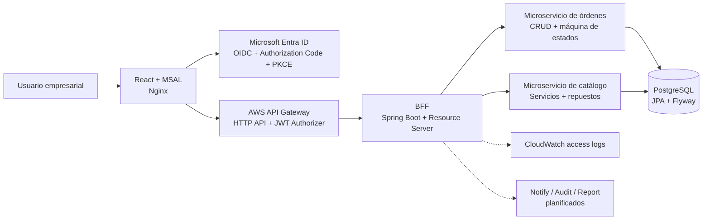

# DigitalFix (Pedidos360)

Plataforma cloud native para la gestión de órdenes de mantención eléctrica de clientes empresariales. El sistema permite crear, consultar y administrar órdenes de trabajo, controlar el catálogo de servicios y repuestos, y aplicar autorización por rol mediante Microsoft Entra ID.

Proyecto semestral del ramo **DSY1107: Desarrollo Cloud Native I**, DuocUC, Chile.

## Arquitectura

En producción, el frontend React obtiene tokens mediante MSAL y los presenta a AWS API Gateway. El API Gateway valida el JWT con un authorizer de Microsoft Entra ID antes de reenviar las solicitudes al BFF. El BFF aplica la autorización de negocio y comunica las solicitudes con los microservicios de dominio.



En el entorno local, Docker Compose reemplaza el tramo público de API Gateway y conecta el frontend, el BFF, el microservicio de órdenes y PostgreSQL en una red interna.

## Funcionalidades y roles

- **Admin:** administra servicios técnicos y repuestos del catálogo. No gestiona órdenes directamente.
- **Supervisor:** crea, consulta y modifica órdenes, incluidos sus cambios de estado.
- **Cliente:** crea órdenes y consulta las órdenes propias.
- **Auditor:** consulta la información de las órdenes y su timeline en modo lectura.

Las órdenes siguen el flujo `CREADA -> ASIGNADA -> EN_DESPLAZAMIENTO -> EN_EJECUCIÓN -> CERRADA` o `CANCELADA`. Una orden no puede pasar a `EN_EJECUCIÓN` sin haber pasado por `ASIGNADA`. Al asignar una orden que requiere repuestos, el stock correspondiente disminuye.

## Stack tecnológico

- **Frontend:** React 19, TypeScript, Vite, MSAL Browser/MSAL React y Nginx.
- **Backend:** Java 21, Spring Boot 4, Spring Security OAuth2 Resource Server, Spring Data JPA, Spring WebMVC y RestClient.
- **Persistencia:** PostgreSQL 15 y Flyway para migraciones versionadas y datos semilla.
- **Identidad:** Microsoft Entra ID mediante OIDC, Authorization Code + PKCE, validación de `issuer`, `audience`, firma y expiración del JWT.
- **Infraestructura:** Docker, Docker Compose, AWS EC2, AWS API Gateway HTTP API, Cloudflare y CloudWatch.
- **Mensajería planificada:** RabbitMQ para notificaciones y Kafka para reportería por streaming.

## Estructura del repositorio

```text
DigitalFix/
├── frontend-digitalfix/       # Aplicación React y configuración de Nginx
├── ms-digitalfix-bff/         # Backend-for-Frontend y seguridad JWT
├── ms-digitalfix-workorders/  # Órdenes, estados, JPA y Flyway
├── ms-digitalfix-catalog/     # Servicios técnicos y stock
├── ms-digitalfix-notify/      # Reservado para notificaciones asíncronas
├── ms-digitalfix-audit/       # Reservado para auditoría
├── ms-digitalfix-report/      # Reservado para reportería
├── infra/                     # Recursos de infraestructura
├── docs/                      # Copias y material de apoyo
└── docker-compose.yml         # Entorno local y despliegue Compose
```

## Levantamiento local con Docker Compose

### Requisitos

- Docker Desktop con Docker Compose v2.
- Una aplicación registrada en Microsoft Entra ID, con una URI de redirección local configurada.
- Acceso a un tenant que emita los roles esperados por el backend.

### Configuración

1. Cree o revise el archivo `.env` en la raíz. No incluya secretos ni publique este archivo.
2. Configure las variables del frontend indicadas en la tabla siguiente.
3. Verifique que la URI `http://localhost/` esté registrada en la aplicación de Entra ID si utilizará el frontend servido por Docker Compose.

### Inicio

Desde la raíz del repositorio:

```bash
docker compose up --build
```

Abra [http://localhost](http://localhost). El frontend se sirve por Nginx en el puerto `80`, el BFF queda disponible en `http://localhost:8080` y PostgreSQL en `localhost:5432`.

Comandos habituales:

```bash
# Ver el estado de los contenedores
docker compose ps

# Seguir los logs de un servicio
docker compose logs -f bff

# Detener el entorno conservando los datos de PostgreSQL
docker compose down

# Detener y eliminar también el volumen de la base de datos
docker compose down -v
```

El primer inicio del microservicio de órdenes ejecuta automáticamente las migraciones Flyway. `docker compose down -v` elimina la base local y debe usarse solo cuando se quiera reiniciar los datos.

### Frontend en modo desarrollo

Para trabajar con Vite sin reconstruir la imagen de Nginx:

```bash
cd frontend-digitalfix
npm ci
npm run dev
```

En este modo, el frontend se sirve normalmente en `http://localhost:5173`. Configure `VITE_BFF_URL=http://localhost:8080` para que las llamadas vayan directamente al BFF y asegúrese de que la configuración CORS del entorno permita ese origen.

## Variables de entorno

El archivo `.env` de la raíz es consumido por Compose y se copia durante la construcción del frontend. Los nombres relevantes son:

| Variable | Uso | Ejemplo local |
| --- | --- | --- |
| `VITE_AZURE_CLIENT_ID` | Client ID de la aplicación registrada en Entra ID | `00000000-0000-0000-0000-000000000000` |
| `VITE_AZURE_TENANT_ID` | ID del tenant de Entra ID | `00000000-0000-0000-0000-000000000000` |
| `VITE_AZURE_REDIRECT_URI` | URI de retorno de MSAL | `http://localhost/` |
| `VITE_API_SCOPE` | Scope solicitado para el API protegido | `api://<API_CLIENT_ID>/access_as_user` |
| `VITE_BFF_URL` | URL base del BFF en desarrollo Vite | `http://localhost:8080` |
| `SPRING_DATASOURCE_URL` | URL JDBC de PostgreSQL | `jdbc:postgresql://postgres-db:5432/digitalfixdb` |
| `SPRING_DATASOURCE_USERNAME` | Usuario de PostgreSQL | `tu_usuario` |
| `SPRING_DATASOURCE_PASSWORD` | Contraseña de PostgreSQL | `tu_password` |

En el Compose actual, los valores de conexión de PostgreSQL se establecen explícitamente para la red interna (`postgres-db`, base `digitalfixdb`) y prevalecen sobre los valores equivalentes del `.env`. El BFF mantiene en su configuración el issuer y las audiences autorizadas; si se cambia de tenant o de registro de aplicación, actualice también `ms-digitalfix-bff/src/main/resources/application.yaml`.

Los identificadores de cliente y tenant no son secretos, pero deben corresponder a los registros de Entra ID utilizados por el entorno. Las credenciales de base de datos sí deben manejarse como secretos fuera del repositorio en un entorno real.

## Seguridad y autorización

El frontend utiliza MSAL con Authorization Code + PKCE (S256) y validación de `state`. El BFF actúa como OAuth2 Resource Server: valida issuer, audience, firma y expiración del token, y extrae el claim `roles` mediante un `JwtAuthenticationConverter` personalizado. Las autoridades se comparan sin el prefijo predeterminado `ROLE_` de Spring Security.

En producción, API Gateway realiza una primera validación del JWT con un authorizer de Microsoft Entra ID, expone rutas versionadas bajo `/api/v1`, aplica CORS y registra los accesos en CloudWatch. El frontend publicado por Nginx usa `/api` como proxy interno hacia el BFF.

## Limitaciones conocidas y roadmap

### Limitaciones actuales

- La EC2 expone directamente el puerto del BFF a `0.0.0.0/0` en el Security Group. Esto no es adecuado para producción.
- Cloudflare opera en modo Flexible SSL: el navegador se conecta por HTTPS, pero el tramo Cloudflare-EC2 permanece en HTTP.
- El despliegue utiliza una sola instancia EC2, sin balanceo de carga ni auto-scaling.
- La construcción actual del frontend incorpora el `.env` dentro de la imagen; los secretos no deben almacenarse allí.
- Los microservicios de notificaciones, auditoría y reportería están definidos en la arquitectura, pero aún no están implementados.

### Roadmap

1. Migrar el backend a una subnet privada y publicar el BFF mediante VPC Link y Network Load Balancer, dejando API Gateway como único punto de entrada.
2. Cambiar Cloudflare a Full (strict) con un certificado válido en el origen.
3. Separar servicios y datos para habilitar alta disponibilidad, balanceo y auto-scaling.
4. Implementar notificaciones asíncronas con RabbitMQ, auditoría de solo lectura y reportería por streaming con Kafka.
5. Gestionar secretos con un servicio administrado y parametrizar issuer, audience, CORS y endpoints por ambiente.
6. Versionar y automatizar el despliegue mediante CI/CD, pruebas de integración y observabilidad centralizada.

## Equipo

- **Diego:** frontend React y autenticación MSAL.
- **Joaquín:** BFF y microservicio de órdenes.
- **Pepe (DamagedGhost):** infraestructura AWS, API Gateway y despliegue.

Repositorio: [DamagedGhost/DigitalFix](https://github.com/DamagedGhost/DigitalFix)